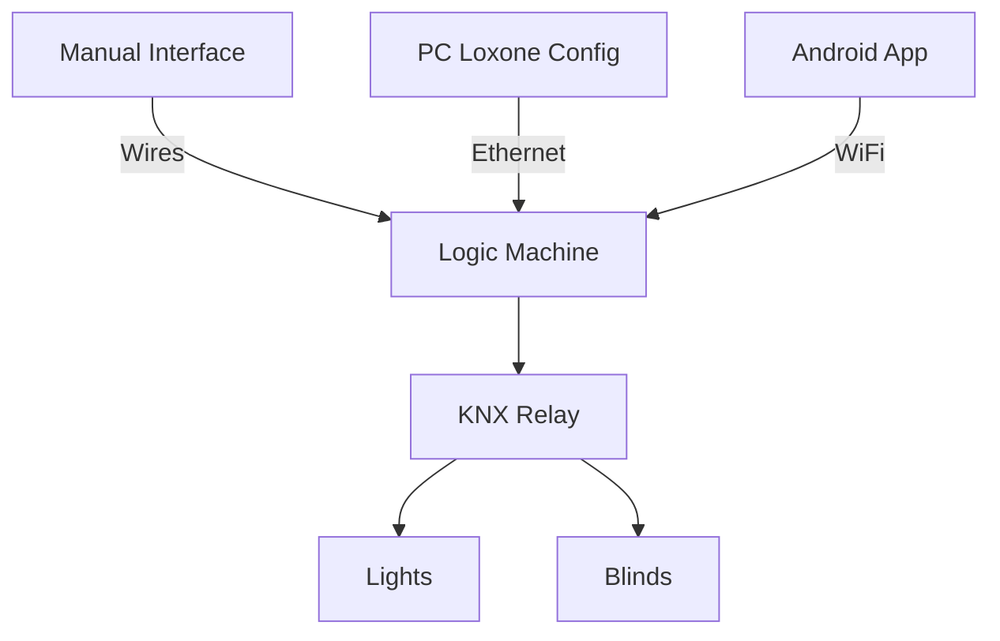

# 🧰 SmartBox-Control — Smart Home Suitcase

## 📌 Description

An autonomous smart home demo unit enabling control via:
- ✅ **Manual** — physical buttons
- 💻 **Software** — Logic Machine on PC
- 📱 **Mobile** — dedicated Android application

---

## 🎯 Features

### Global Controls
- 🚀 **Master ON/OFF** for all lights simultaneously
- 🌞 **Simultaneous raise/lower** of all blinds

### Individual Controls
- 💡 **Light by light** — turn each lamp on/off independently
- 🪟 **Blind by blind** — precise positioning of each shutter

---

## 🛠️ Technical Configuration

| Component       | Model                | Qty |
|-----------------|----------------------|-----|
| Loxone Module   | Miniserver Gen2      | 1   |
| Relay           | KNX 8x230V           | 1   |
| Power Supply    | MeanWell 24V/5A      | 1   |
| Lights          | LED 12W 2700K        | 4   |
| Blinds          | Somfy Sonesse 30     | 2   |

---

## 🔌 System Architecture

